## Open Source Mining
Hydra Pool is an [open-source](https://www.gnu.org/licenses/gpl-3.0.html) Bitcoin mining pool built to be "one-click" deployable and self-hosted. 

Help us test Hydra Pool by pointing your miner to: `stratum+tcp://test.hydrapool.org:3333`

Use any vanity username you want, no need to add a BTC address. The test iteration of Hydra Pool is configured to payout to the 256 Foundation BTC address.

Pool Statistics can be monitored at: [test.hydrapool.org](https://test.hydrapool.org)

A table of the tested hardware is presented <a href="/hardware-tests.html" target="blank" rel="noopener noreferrer">here</a>.

<br>

## Motivation
Mining pools are naturally and increasingly centralized, prohibatively complex for an average user to setup, and very few are open-source. We set out to change all that with by building Hydra Pool. In the event that authoritative governments attempt to coerce mining pools to do things that mining operators disagree with, there needs to be easily deployable options readily available to quickly divert hashrate from such choke points. For example, these threats could be in the form of forcing pools to KYC their users, or forcing pools to censor OFAC transactions, or orphaning blocks containing transactions they want censored based on any arbitrary factor. If anyone can spin up a mining pool on their Ember One mining system, with a self-hosted computer, or a VPS and this open-source project then miners are going to be able to pool their resources back together faster and the pressure will grow exponentially on the resources needed to enforce restrictions on mining. In short, Hydra Pool is a project to make deploying a mining pool server with a Bitcoin node and Stratum v1/v2 server as easy as "one-click". 

<p align="center">

</p>

If you appreciate what we have built with Hydra Pool, then send The 256 Foundaton a tax deductible donation [here](https://pay.zaprite.com/pl_ZRWeSGjRWG)! Or use The 256 Foundation [PayNym](https://paynym.rs/+appetizingadministration90)!

<br>

## Features
* Run a private solo pool or a public PPLNS pool for your community of miners.
* Extensible so users can implement payment mechanisms to pay out miners based on the share accounting.
* Payouts are made directly from coinbase - pool operator doesn't custody any funds. By default, Hydra Pool supports 100 unique users in the coinbase and this can be configured by the user with [these](https://github.com/256foundation/hydrapool?tab=readme-ov-file#configuring-blockmaxweight-on-bitcoin) instructions. No need to trust the pool operator.
* Run share accounting on the stored shares.
* Let users download and validate the accounting of shares. We provide an API for the same. See [API Server](https://github.com/256foundation/hydrapool#api).
* Scalable and robust database support to save received shares.
* Prometheus and Grafana based dashboard for pool, user and worker hashrates and uptimes.
* Pool application for linux that talks to bitcoind and provides stratum work to users and stores received shares.
* Use any bitcoin node that supports bitcoin RPC.
* Implemented in Rust, for ease of extending the pool with novel accounting and payout schemes.
* Open source with AGPLv3. Feel free to extend and/or make changes.
* Rolling upgrades: Tools and scripts to upgrade server with zero downtime.

The initial release of Hydra Pool is being built in such a way that it supports long-term goals like alternative payout models such as echash, communicating with other Hydra Pool instances via [P2Poolv2](https://github.com/p2poolv2/p2poolv2), Local store of shares, and a user-friendly interface that puts controls at the user's fingertips, and supports the ability for upstream pool proxying.

## Community Support
For help with Hydra Pool, please use [The 256 Foundation public forum](https://t.me/the256foundation) on Telegram. Follow the 256 Foundation [twitter](https://x.com/256foundation) account. Or join the [OSMU Discord](https://discord.gg/9bWxRpj4) and see the 256 Foundation channel. 

# Step-by-Step Guide: Creating a Hydra Pool Server
The following material explains how to create your own Hydra Pool server using an old Dell Optiplex 9020 desktop computer flashed with Ubuntu Server 24.04.3 LTS, installing and running bitcoind from Snap, and using the Hydra Pool Docker files only. There are many variations to deploying a server; from types of hardware to Operating System, to which Bitcoin client to use, to compiling Hydra Pool from source. No other variations are explained here but you should be able to find some helpful information and links which you could use in part to setup your own unique server. You can find more details in the [Hydra Pool README](https://github.com/256foundation/hydrapool) file on GitHub.

## Download Ubuntu:
Navigate to: [this URL](https://releases.ubuntu.com/)

<p align="center">
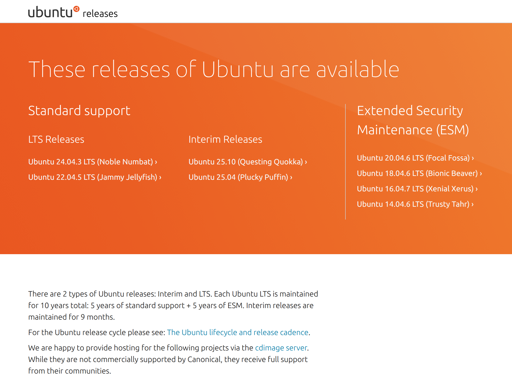
</p>

In this example, we will be looking for the latest Standard Support LTS release, 24.04.3 LTS (Noble Numbat). 
Scroll down on this page and click on the hyper link for the desired release directory, such as “24.04.3/”.

<p align="center">
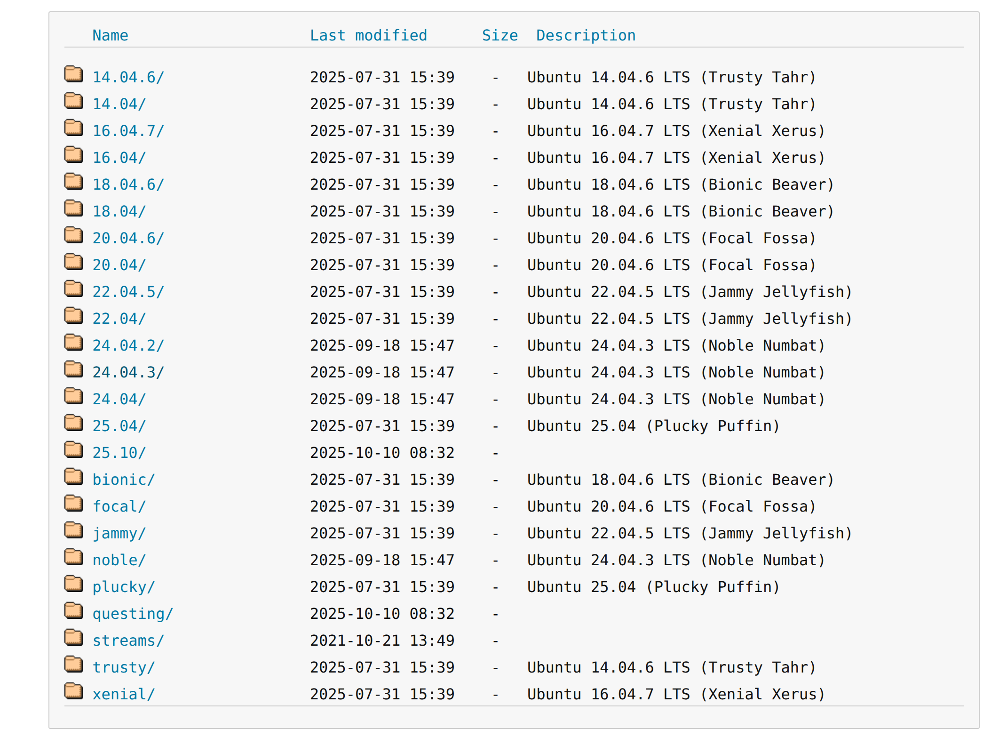
</p>

Click on the desired image file, “ubuntu-24.04.3-live-server-amd64.iso” in this example and save the file to a convenient directory on your computer like your “Downloads” folder. 
If you want to verify your download, which you should, you will need to also get the required signature files.

<p align="center">
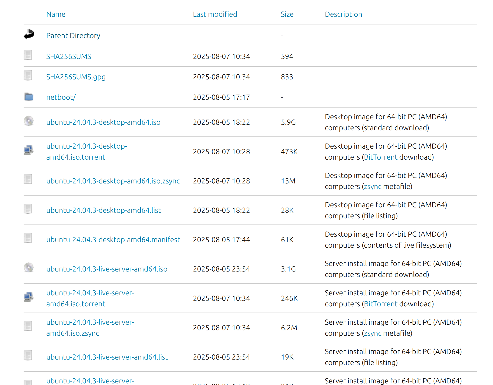
</p>

When you click on the hyperlink for the “SHA256SUMS” file, your browser will probably display the information in plain text in a new tab. Select all text, open your note pad application, and paste the copied text in a new note file. Then save the new note file to the same directory you saved the Ubuntu Server image file, the “Downloads” directory in this example, be sure to name the file exactly as it is named on the website, for instance: “SHA256SUMS” not “SHA256SUMS.txt”.


Next, click on the “SHA256SUMS.gpg” file to download it and also save this file in your “Downloads” directory.
Your Downloads directory should look like this:

<p align="center">
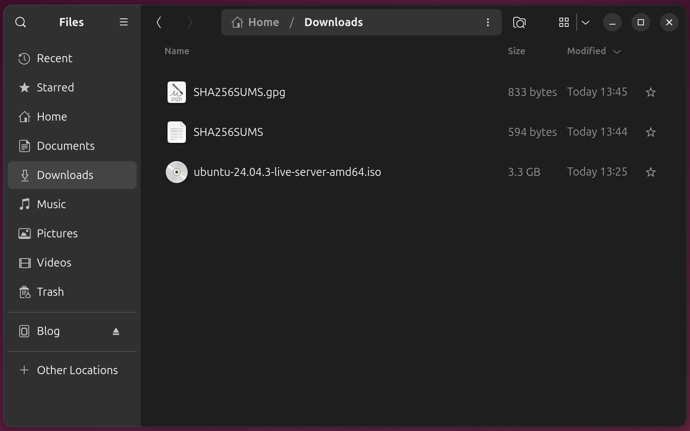
</p>

## Verify Download
With those three files saved to your “Downloads” folder, you can now open your Terminal window and start the verification process.
Detailed verification instructions can be found [here](https://ubuntu.com/tutorials/how-to-verify-ubuntu#1-overview) for reference: 

In your Terminal window, change directories to your “Downloads” folder with the following command:

`cd Downloads`

Then use the gpg command to compare the sha256sum files and see if your computer already has the Ubuntu public keys installed:

`gpg --keyid-format long --verify SHA256SUMS.gpg SHA256SUMS`

If your computer did not have the Ubuntu public key installed already, then you will see a response in your Terminal window like this:

<p align="center">
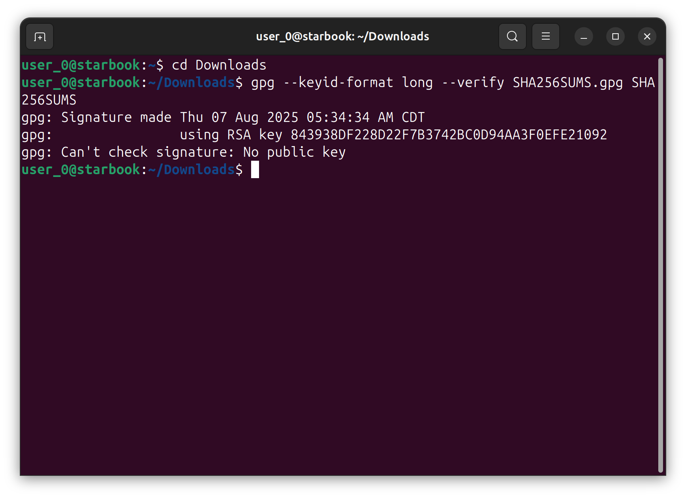
</p>

This is good because the response is telling us which public key was used to make the signature, so now we can request this specific key from the key server with the following command. Be sure to use the key fingerprint returned from your Terminal window and add the “0x” prefix since it needs to be in hexadecimal:

`curl -fsSL "http://keyserver.ubuntu.com/pks/lookup?op=get&options=mr&search=0x843938DF228D22F7B3742BC0D94AA3F0EFE21092" | gpg --import`

You should get a response like the one below that shows at the key was imported. You can ignore the warning at the bottom that says “no ultimately trusted keys found”; this warning appears if you haven’t created your own GPG key or haven’t set trust levels for imported keys, this warning appears because GPG has no anchor of trust. The warning is informational and does not prevent key import or basic functionality.

<p align="center">
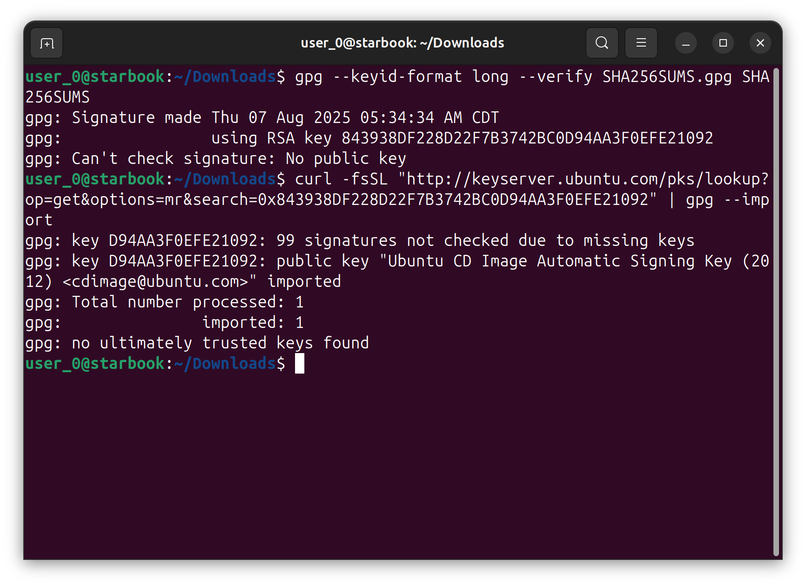
</p>

Now run this command again:

`gpg --keyid-format long --verify SHA256SUMS.gpg SHA256SUMS`

Then you should get a response like the one below that shows “Good signature from "Ubuntu CD Image Automatic Signing Key (2012) <cdimage@ubuntu.com>"”. Again, you can ignore the warning about the key not being certified for the same reasons mentioned above.

<p align="center">
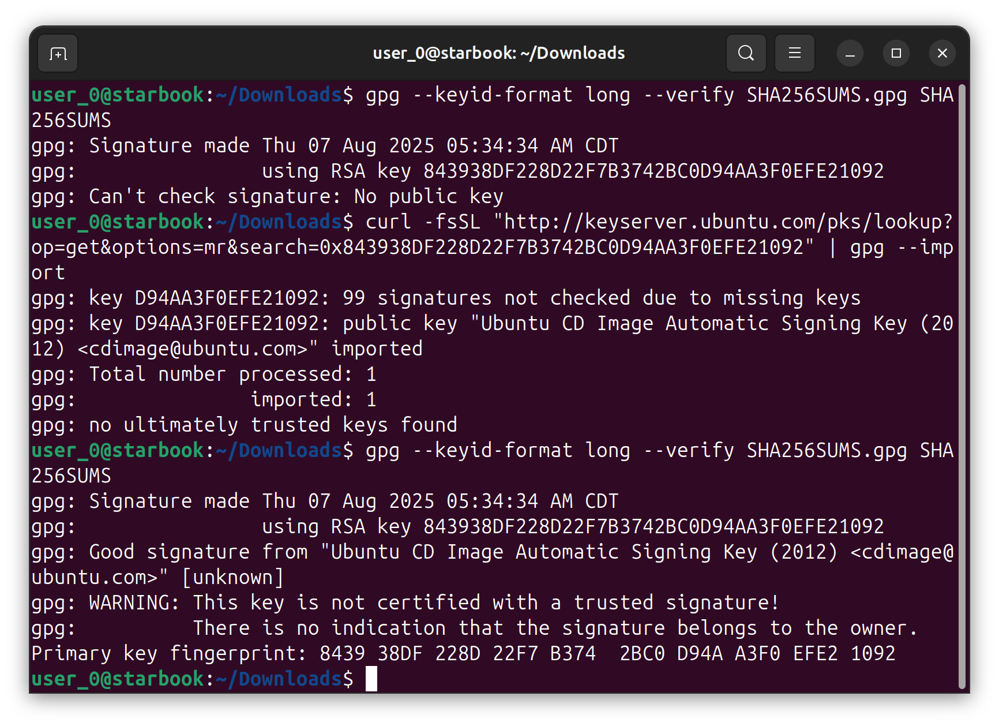
</p>

Next, we can compute the sha256 hash value on the image file and compare that with the hash value given in the “SHA256SUMS” file that we now know has a good signature from the Unbuntu public key. Run the sha256sum command from your “Downloads” directory, or which ever directory you saved the three files in, making sure to enter the name of your image file:

`sha256sum ubuntu-24.04.3-live-server-amd64.iso`

You can open your SHA256SUMS file with your text editor and see the text inside, then compare the relavent entry to the response you received in the Terminal window.

<p align="center">
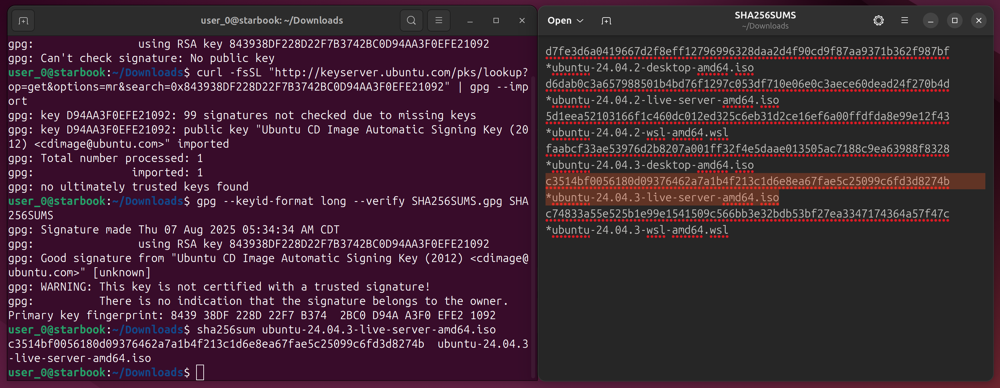
</p>

With the download now verified, we can move on to flashing the image file onto a USB drive.

## Flashing
Your computer may have a flashing program already installed, in this example I’m using the Startup Disk Creator that came with my Ubuntu desktop OS. [Balena Etcher](https://etcher.balena.io/) is an excellent tool if you are looking for one.

The flashing process is very simple and generally works the same no matter which program you are using. Basically, you just need to select the image file you want to flash and the drive you want to flash the image to. In this example, the flashing program is pointed to the “Downloads” folder where the Ubuntu Server image file is. The destination in the flashing program is pointed to an 8GB USB drive that has already been formatted and cleared of all files. 

<p align="center">
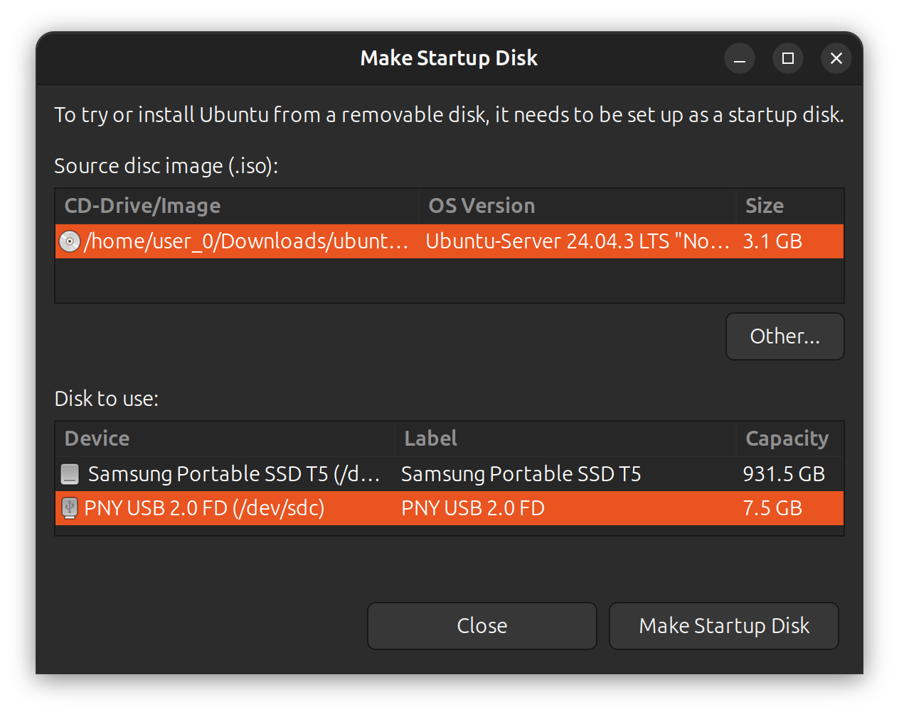
</p>

After the flashing has completed, you can eject the USB drive and you are ready to flash your new server.

Insert the USB drive into the computer that will be your new Hydra Pool server. Make sure you have saved and removed any files you want to keep since everything currently on this computer will get erased in the flash process. 
With the USB drive inserted, turn the computer on or restart it if it was already running. You will need to enter the BIOS which can usually be achieved by holding down the “shift” key or “F8” key or in this example with a 2014 Dell Optiplex 9020, it was the “F12” key.

If your computer boots up and loads your normal operating system, then you were not holding down the right key at the right time during the boot process. In this case, continue restarting the computer and try different keys until you find the right one. Try doing some online research for your specific hardware if the problem persists. 

You should see a screen like this once you get into the BIOS:

<p align="center">
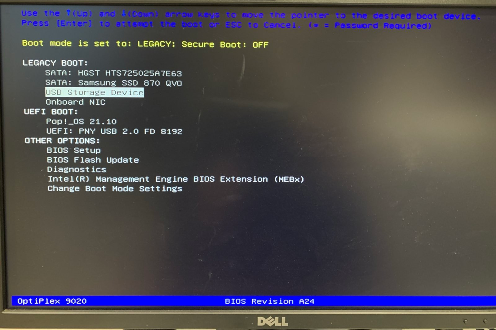
</p>

Select the USB device you want to boot from using the up/down arrows on the keyboard. Then on the next screen, select the option to “try or install Ubuntu Server”.

<p align="center">
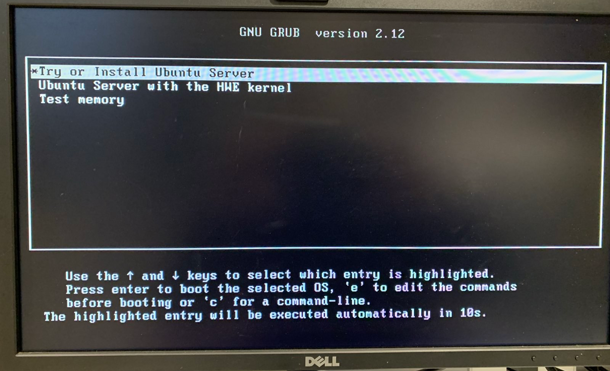
</p>

Then you will be prompted to set your language and keyboard layout. Do so using the up/down arrows and the enter key.

Then you will have the option to select the Ubuntu Server or Ubuntu Server (Minimized). If you’re unsure which one to use, just stick with Ubuntu Server. 

Then you will set the network configuration which should be automatically detected, just use the default unless you have a reason to change it.

Then it will ask you to enter proxy configuration details if you have them. If you don’t know what those are, just leave it blank and hit enter to continue.

Then the installer will check the Ubuntu Archive mirror for some packages. Let it run through this process undisturbed until you see “reading packages…”

Next, the installer will ask you to select a drive for the installation, this will be the drive that gets erased and formatted and have the operating system installed. You will have the option to encrypt the drive and enter the passphrase that will be needed each time the computer boots up, if you choose to do this, there are a few extra steps required that will not be covered in this guide so that you can remotely decrypt the hard drive on reboot; do some research on “dropbear-initramfs” if you want to go that route. Once you have this page configured how you want, use the tab key to get to the bottom of the screen to select “Done” then hit enter.

Then you will be presented with a file system summery. Double check to make sure that everything looks good. For example, here is mine:

<p align="center">
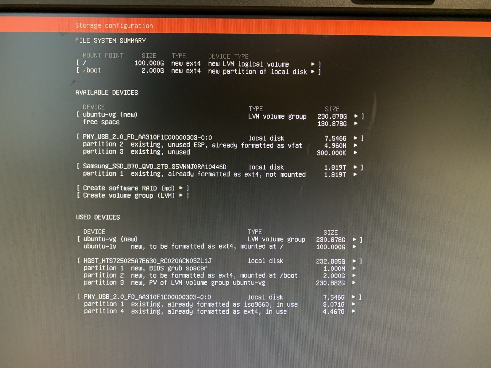
</p>

The installer will ask you to confirm you want to proceed. Select continue and hit enter. 

Then the installer will ask you to setup your user profile, enter a name and username, they can be the same. Enter a server name and set your user password. Use the tab key to select “Done” when finished and hit enter.

You will then be asked if you want to upgrade to Ubuntu Pro, if you are unsure, just leave it on the default selection and skip for now.

Next, I recommend enabling OpenSSH by using the space key to select “Install OpenSSH server”. If you have an SSH key, you have the option to import that now. If you don’t or are unsure, just use the tab key to select “Done” at the bottom of the screen and hit enter to continue. 

The installer will then present you with a list of popular snaps, feel free to select any that you want. For this example, I skipped all of them. 

Then the system will update based on the way you made your configurations. This process takes a couple minutes so let it run and then you can select the “view full log” option and look for the response: “finish: cmd-in-target: SUCCESS: curtain cmd in-target” to confirm that the process is finished. Select “close” at the bottom of the screen to return to the prior screen.

Now you can select “Reboot now” at the bottom of the screen, remove the USB drive that you ran the installer from. If you don’t remove the USB drive fast enough, you will get a failed to boot warning and a request for you to remove the USB drive and then hit enter to reattempt booting up. Then your new server should boot up. If you don’t already know the local IP address of your new Hydra Pool server, then hit enter and you should be prompted to log-in using the username and password you set. Once you successfully log-in, you will see a few basic stats displayed like memory usage, temperature, and local IP address. Note this local IP address. Now you can disconnect the keyboard and monitor as you will connect remotely for the remainder of the setup.

## SSH
You will need the local IP address of your new server so that you can remotely communicate with it. From your laptop connected to the same local network, open your Terminal window and use the SSH command to remotely connect to your Hydra Pool server. Your command should look something like this, making sure you use your Hydra Pool server’s username and local IP address noted above. 

`ssh username@192.168.69.123`

You will likely get a response that the authenticity of the host you are trying to connect to cannot be established. You can type in "yes" to proceed and hit enter.

Then you should be prompted for the password, enter that, and then you should be greeted with the same basic stats you saw on the monitor when it was connected to the server.

This is a good point to run some updates to make sure your new server is caught up with changes to packages which occurred between the time your image file was created and now. Run the following command:

`sudo apt update`

Since you are using sudo, you will likely be asked for your password again. Enter that and hit enter. Then you will be presented with a response letting you know how many packages can be updated. To install all the updates, run the following command:

`sudo apt upgrade -y`

Let the process run until complete. 

Now this is a good time to get the auxiliary hard drive mounted. The auxiliary hard drive in this example has already been formatted to use the ex4 file system prior to installation. If you need to format your hard drive then do an internet search for “how to format hard drive ubuntu”. To mount it, first you need to identify the drive and the partition, run the following command:

`sudo fdisk -l`

the response will show you the connected devices and their partitions. The one I’m interested in mounting is "/dev/sdb1". Take note of the device identifier you are mounting.

<p align="center">
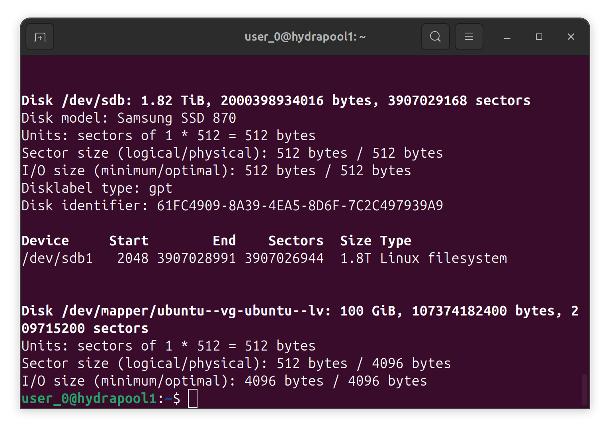
</p>

Next, create a mount point directory. You can name the folders whatever you want but it’s a good idea to use something that makes sense like "/mnt/auxdrive"

`sudo mkdir /mnt/auxdrive`

Next, mount the device to that directory with the following command being sure to use your device identifier and the directory path you created:

`sudo mount /dev/sdb1 /mnt/auxdrive`

You are going to want this drive to automatically mount at system boot, to do that an entry needs to be made in the "fstab" file that identifies the drive with it’s UUID, the mount point, and some other information. First, get the UUID with the following command:

`sudo blkid`

You will get a response that shows each connected device, look for the drive identifier you want like "/dev/sdb1", note the UUID to add to the "fstab" file or just highlight the UUID with the cursor and hit ctrl+shift+c to put it on your clipboard. 

<p align="center">
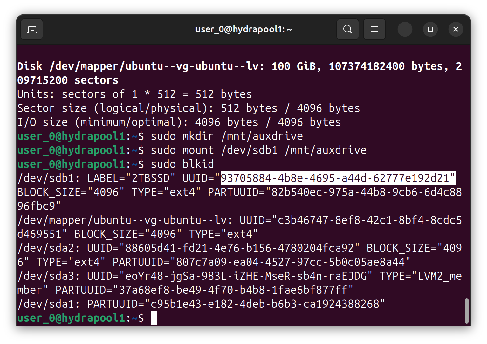
</p>

Next, open the "fstab" file with nano to edit it:

`sudo nano /etc/fstab`

Use your down arrow to get to the bottom of all the existing text and on a new line make an entry that defines the UUID, the mount point, the file system type, the defaults setting, and then define the dump frequency with a 0 and another 0 for the file system check order. For example:

<p align="center">
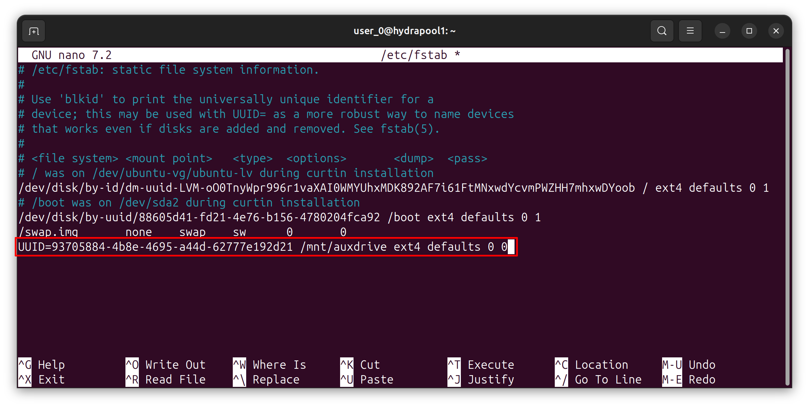
</p>

Then hit ctrl+o to write the "fstab" file changes, press enter to save it, then ctrl+x to exit and get back to the main Terminal session.

To check that everything has worked you can run the following command to see a list of mounted drives, then restart your system and run the command again to check if your drive automatically mounted at system reboot.

To see mount list run:

`df -h`

To reboot run:

`sudo reboot`

## Installing bitcoind
These instructions will cover how to install the Bitcoin Core client. 

Run this command to update your system:

`sudo apt update`

You will likely be prompted to enter your password if you rebooted your system to ensure your hard drive automatically mounted. 

Then run this command to install the Ubuntu package manager called "snapd":

`sudo apt install snapd`

Then run this command to install Bitcoin Core:

`sudo snap install bitcoin-core`

Next, we want to create the data directory where the configuration file and blockchain data will be written. In this example, I want this data on the 2TB auxiliary drive, so I will run this command to create a new bitcoin data directory on the auxiliary drive:

`sudo mkdir /mnt/auxdrive/bitcoin-data` 

Next, I will modify ownership of this new directory so my user can read/write, be sure to use your username where it says “username”:

`sudo chown username:username /mnt/auxdrive/bitcoin-data`

Now we need to create a different directory for bitcoin-core because although it is usually created automatically by the snap system the first time a snap application needs to store user data, such as configuration files or databases; in this example we are configuring bitcoin-core so Snap has not created the necessary directory yet. We can create it manually with the following command, be sure to replace “username” with your actual username: 

`sudo mkdir -p /home/username/snap/bitcoin-core/common/.bitcoin`

Now we can use "nano" to create the "bitcoin.conf" file with this command:

`sudo nano /home/username/snap/bitcoin-core/common/.bitcoin/bitcoin.conf`

Then populate the new "bitcoin.conf" file like this:

~~~java
datadir=/mnt/auxdrive/bitcoin-data
server=1
rpcuser=your_unique_username
rpcpassword=your_strong_password
zmqpubhashblock=tcp://127.0.0.1:28334
# for Docker (for Hydrapool)
rpcallowip=172.16.0.0/12
rpcbind=0.0.0.0
~~~

Then hit ctrl+o to write the file changes, press enter to save it, then ctrl+x to exit and get back to the main Terminal session.
 
Before starting the bitcoin daemon, ensure your user has access to the directory you manually created using this command, be sure to use your actual username in place of “username”:

`sudo chown -R username:username /home/user_0/snap`

Then make sure that Snap can communicate with the auxiliary hard drive with this command:

`sudo snap connect bitcoin-core:removable-media`

Now run the following command to start bitcoind:

`/snap/bin/bitcoin-core.daemon -daemon`

You should get a response that Bitcoin Core is starting. Now you can monitor the Initial Block Download progress with the following command:

`tail -f /mnt/auxdrive/bitcoin-data/debug.log`

This will take a while, so leave it to run. However, if you want to close your Terminal window, the bitcoind process will get stopped. In order to prevent this and have bitcoind continue running when you kill your remote session and to have it start on system boot, follow these steps:

If you’re still watching the IBD progress, then hit ctrl+c to exit. Then run this command to stop bitcoind:

`/snap/bin/bitcoin-core.cli stop` 

Next, Create a "systemd" service file with this command:

`sudo nano /etc/systemd/system/bitcoind.service` 

Then, populate the new file with the following text, making sure to replace “username” with your actual username:

~~~java
[Unit]
Description=Bitcoin Core Daemon
After=network.target

[Service]
Type=simple
User=username
ExecStart=/snap/bin/bitcoin-core.daemon
ExecStop=/snap/bin/bitcoin-core.cli stop
Restart=always
RestartSec=30

[Install]
WantedBy=multi-user.target 
~~~

Then hit ctrl+o to write the file changes, press enter to save it, then ctrl+x to exit and get back to the main Terminal session.

Set the ownership of the file you just created with this command, ensure you replace “username” with your actual username:

`sudo chown username:username -R /etc/systemd/system/bitcoind.service`

Then reload and start the new service with the following three commands:

`sudo systemctl daemon-reload`

`sudo systemctl enable bitcoind.service`

`sudo systemctl start bitcoind.service`

Now you can check the status of your new service with this command:

`sudo systemctl status bitcoind.service` 

Hit ctrl+c to exit that if everything looks good.

Then you can always monitor what "bitcoind" is doing in real-time with this command again:

`tail -f /mnt/auxdrive/bitcoin-data/debug.log`

It’s not a bad idea to try exiting your remote session by closing your terminal window and logging back in and checking the service status and logs to make sure everything kept running. If that all works well, then just let it run and download the whole blockchain. 

...24-hours later

## Install Docker
The following steps come from the [Docker instructions](https://docs.docker.com/engine/install/ubuntu#install-using-the-repository) for installing using the “apt” repository for Ubuntu:

Add Docker's official GPG key:

`sudo apt update`

`sudo apt install ca-certificates curl`

`sudo install -m 0755 -d /etc/apt/keyrings`

`sudo curl -fsSL https://download.docker.com/linux/ubuntu/gpg -o /etc/apt/keyrings/docker.asc`

`sudo chmod a+r /etc/apt/keyrings/docker.asc`

Add the repository to Apt sources. The following is all one single command, copy/paste the whole all 7 lines simultaneously:

~~~java
sudo tee /etc/apt/sources.list.d/docker.sources <<EOF 
Types: deb 
URIs: https://download.docker.com/linux/ubuntu 
Suites: $(. /etc/os-release && echo "${UBUNTU_CODENAME:-$VERSION_CODENAME}")
Components: stable 
Signed-By: /etc/apt/keyrings/docker.asc 
EOF
~~~

`sudo apt update`

That takes care of setting up Docker’s “apt” repository. Next, we will install the Docker packages with:

`sudo apt install docker-ce docker-ce-cli containerd.io docker-buildx-plugin docker-compose-plugin`

Then check the Docker status with:

`sudo systemctl status docker`

<p align="center">
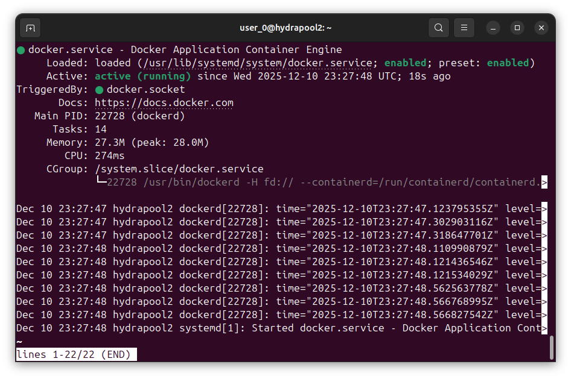
</p>

Hit ctrl+c to exit that screen.

Or in the event it was not automatically started, you should be able to manually start it with:

`sudo systemctl start docker`

Now verify the installation was successful by running:

`sudo docker run hello-world`

Your terminal should respond with “hello world!”

<p align="center">
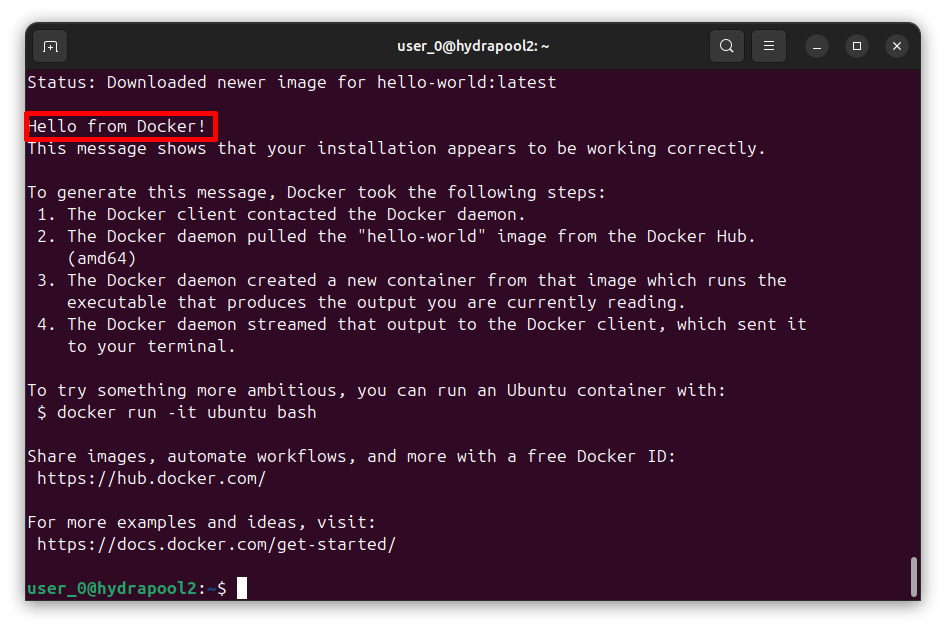
</p>

## Install Hydra Pool
Now we can install Hydra Pool from the GitHub repository by fetching the docker-compose.yml file and then fetching the config-example.toml file.

Create a new folder called “hydrapool” to save these new files into:

`mkdir hydrapool`


Then switch into that new directory:

`cd hydrapool`

Then pull in the configuration files from GitHub:

`curl --proto '=https' --tlsv1.2 -LsSf -o docker-compose.yml https://github.com/256foundation/hydrapool/releases/latest/download/docker-compose.yml`

`curl --proto '=https' --tlsv1.2 -LsSf -o config.toml https://github.com/256foundation/hydrapool/releases/latest/download/config-example.toml`

Now edit the Hydra Pool config.toml file:

`nano config.toml`

Leave the store fields as their defaults.

Leave the stratum fields as their defaults.

The first parameter to change is the “bootstrap_address”

Delete the default address and copy/paste your own bitcoin address. This is the address that a block reward will payout to in the event a block is found in the first 10-seconds or so after the server boots up.

Next, and optionally, you can set a donation address to send a percentage of the block reward in the event you do find a block. This could be a charity, a friend, the 256 Foundation, or any bitcoin address you want. Percentage is calculated in basis points, so 100 = 1%, 200 = 2%, 300 = 3% and so on. By default this is not activated, delete the # symbols on the “donation_address” line and “donation” line if you want to activate this feature.

Next, and also optionally, you can use this configuration to set an address that you control and a percentage that you want to collect in the event of a block find for your overhead in providing the Hydra Pool server. Percentage again is calculated in basis points. By default this is not activated, delete the # symbols on the “donation_address” line and “donation” line if you want to activate this feature.

Next, ensure the “zmqpubhashblock” field is set to: "tcp://host.docker.internal:28334" 

Next ensure the “network” field is set to the network you want to operate on: “main” for Bitcoin mainnet.

Leave the version_mask field on the default.

Leave the difficulty_multiplier field on the default.

You can change the pool_signature field if you want it to say something beside “hydrapool”, max 16 bytes. 

Ensure that the url under the “bitcoinrpc” section is set as follows for mainnet:

`url = "http://host.docker.internal:8332"`

Next you want to set the username and password, you will want these credentials to match what you used in your "bitcoin.conf" file for “rpcuser” and “rpcpassword” so that you can make the RPC connection. 

Leave the logging information on the defaults.

Leave the api information on the defaults.

For the API authentication, you want to update the “auth_user” and “auth_token” to your own generated credentials if you are making this a publicly accessible pool server. Otherwise, if this is just for your own private use and is not publicly accessible then you can leave the defaults and skip down to the part about starting your Hydra Pool server.

Change the “auth_user” to the same username you are using above.

For the “auth_token”, the easiest way to generate this is to open a new terminal window and ssh into your hydrapool server. 

Change to the "hydrapool" directory with:

`cd hydrapool`

Then run the following command being sure to insert your username where it says “username” and your password where it says “password”:

`sudo docker compose run --rm hydrapool-cli gen-auth username password`

A script will run and then respond back with your auth_token. Select the full token, hit ctrl+shift+c to copy it to your clipboard. Then in your other terminal window where you have the "config.toml" file open, delete the existing default auth_token and hit ctrl+shift+v to paste the one on your clipboard. 

Now hit ctrl+o to write the changes to the file, then enter to keep the name, then ctrl+x to exit back to the terminal.

You need to update the Prometheus credentials to match so your database works properly. From your hydrapool directory, create a new file called “prometheus.yml” with this command:

`touch prometheus.yml`

Now open that new file so you can edit it with this command:

`nano prometheus.yml`

In your web browser, navigate to this URL: https://github.com/256foundation/hydrapool/blob/main/prometheus/prometheus.yml

Use the “copy raw file” function to copy the file text to your clipboard. 

Back in your terminal window, hit ctrl+shift+v to paste the contents.

Navigate down to the bottom of the file and update the username field to your username, then update the password field to the password you supplied to the gen_auth tool. This should be the same password you have used for the bitcoin RPC settings.

Exit the hydrapool directory with this command:

`cd`

Then restart Prometheus with this command: 

`sudo docker compose restart prometheus`

You also need to update the docker-compose.yml file so that the username and password match what you entered in the prometheus.yml file. From your hydrapool director, open the docker-compose.yml file to edit it with:

`nano docker-compose.yml`

Then scroll down to the "test" line and enter your username and your password where they are called for:

```yaml
    healthcheck:
      test: ["CMD", "wget", "--spider", "-q", "--http-user=USERNAME", "--http-password=PASSWORD", "--auth-no-challenge", "http://localhost:46884/health"]
```

Hit ctrl+o to write, enter to save, and ctrl+x to exit the text editor.

Now, from the "hydrapool" directory, start the pool service with this command:

`sudo docker compose -f docker-compose.yml up -d`

You should now be able to open your web browser and enter the IP address of your server appended with port 3000 to see the Grafana dashboard. For example:

`http://192.168.69.420:3000`

<p align="center">
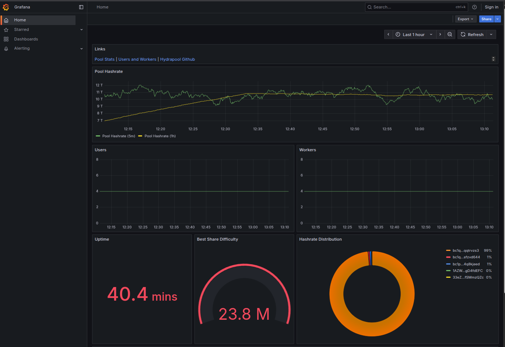
</p>

If you are opening your server up to be publicly accessible then you will need to configure your router to allow that and then update your DNS records for your domain name to point to your server.

<br>

<br>
<br>

<br>
